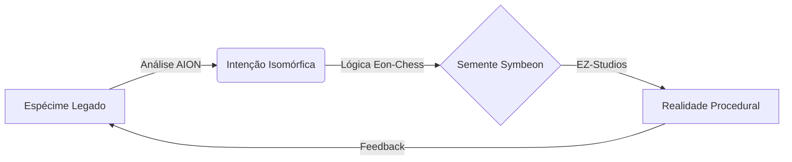

# Protocolo Symbeon: O Renascimento do Código Infinito 🌀💎🕶️

> **ARQUIVAR → PONTE → SEMEAR → GERAR**

O **Protocolo Symbeon** é a metodologia central da **EZ-Fundation**. É o fluxo de trabalho unificado projetado para resgatar artefatos digitais legados e transmutá-los em experiências soberanas, procedurais e infinitas.

[**English**](README.md) | [**Português**](README_PT.md)

---

## 🏛️ Os Três Pilares

O protocolo opera através da sinergia de três pilares arquitetônicos:

1.  **Arqueologia (AION-Core):** Extração do "DNA Digital" e intenções lógicas de binários compilados.
2.  **Lógica (Eon-Chess):** Fornecimento de maestria algorítmica pura e destilada para governar tomadas de decisão.
3.  **Geração (EZ-Studios-Core):** Uso das sementes extraídas para construir projetos de realidade procedural infinita.

---

## 🔄 O Fluxo de Trabalho Symbeon

## 🌌 Nossa Filosofia
Acreditamos que nenhum código está verdadeiramente morto. Nas profundezas de cada binário obsoleto reside uma sequência de criatividade humana que vale a pena preservar. O Protocolo Symbeon é a ponte que permite que essa criatividade transcenda seu hardware original e floresça na era da Inteligência Artificial.

## 🛠️ Padrões Técnicos
Para informações detalhadas sobre formatos de troca de dados, consulte [SPECIFICATION.md](SPECIFICATION.md).

---
**Soberania através da Transmutação.**
*EZ-Fundation - 2026*
